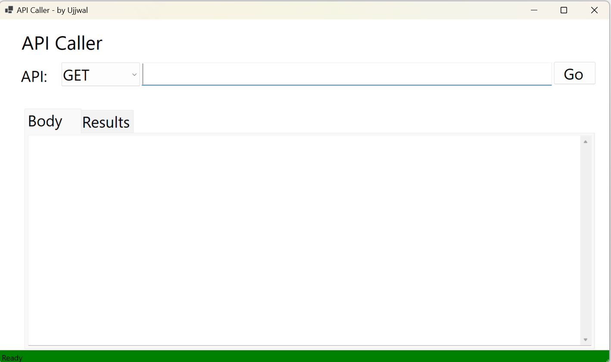
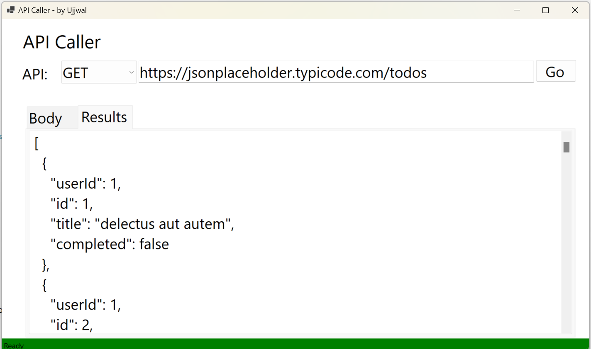
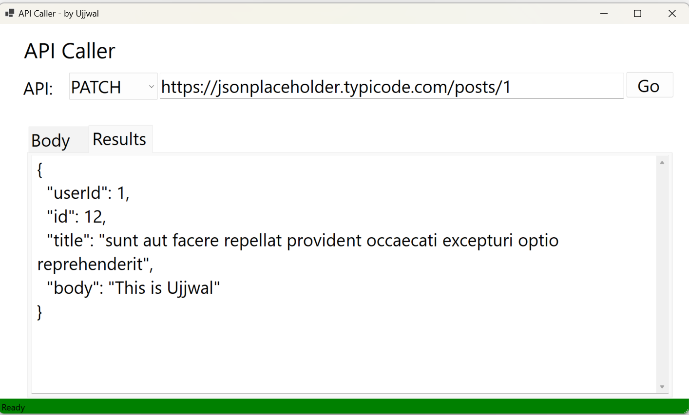

# API Caller App
API Caller App provides a user-friendly interface for making CRUD requests to APIs and viewing the responses in formatted JSON. Ideal for developers and testers, this tool simplifies the API interaction and debugging, helping you efficiently validate and troubleshoot your API calls.

## Technologies Used: 
* C#
* .Net 8
* WinForms
* HttpClient

## Using the App
1. Download the executable file from the release section
2. When the application launches, it should look like this:

3. Fill in your API URL and hit "Go":

## Upcoming Changes:
* Adding API Headers
* Handling API Authentication
* Adding Logging
* Supporting other data type in Body, i.e. apart from application/json. 
